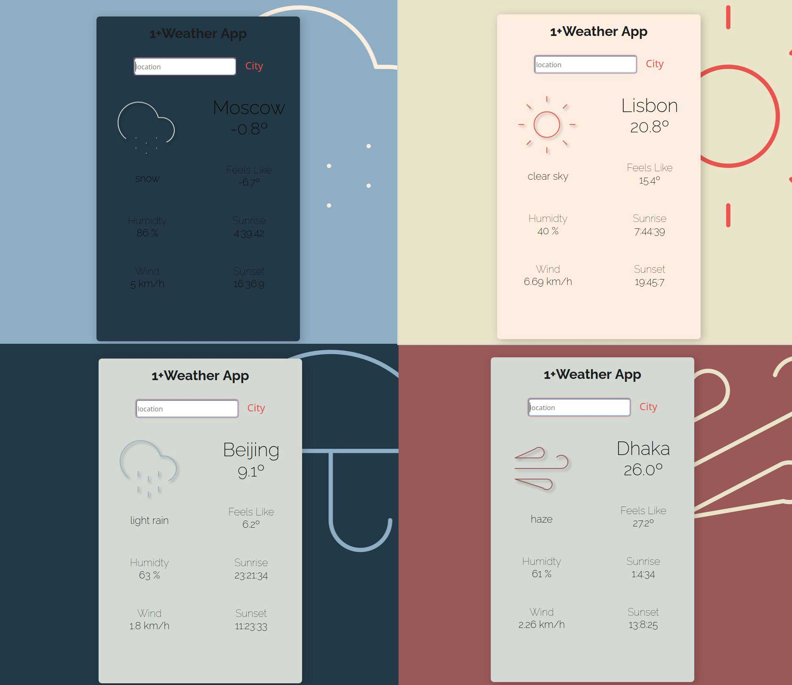

# weatherapp

TOP - Weather App project

1+Weather App [Live Demo](https://mvquinta.github.io/weatherapp/)

Made with HTML, CSS, JavaScript and Webpack to bundle it.

This project allowed me to learn and practice how to work with an API and with Async.

Main features:

- Using fetch to call Open Weather API
- Async and Await
- UI changes depending on weather of searched city

Future updates could be:
 - Feel that it deserves a better CCS work with better positioning and some animations.

 - For a potentially v2 version, that will definitely be one of the mais objectives

///////////////////////////////

//////////////////////////////

This was my take for the project of [The Odin Project](www.theodinproject.com)
